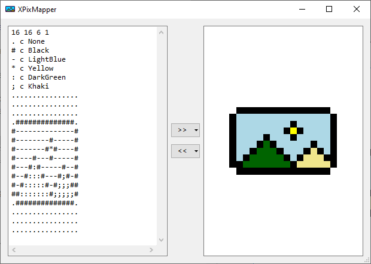

<p align="center">
  <a href="https://github.com/akesseler/xpixmapper/blob/master/LICENSE.md" alt="license">
    
  </a>
  <a href="https://github.com/akesseler/xpixmapper/releases/latest" alt="latest">
    
  </a>
  <a href="https://github.com/akesseler/xpixmapper/archive/master.zip" alt="master">
    
  </a>
</p>

## XPixMapper

The _Plexdata XPixMapper_ is a program that is able to convert _X11 Pix Maps_ into images and 
vise versa.

### Features

* Conversion of X11 Pix Maps into images.
* Conversion of images into X11 Pix Maps.
* GUI tool to perform conversion.
* Library to include in own projects.

### Licensing

The software has been published under the terms of _MIT License_.

### Downloads

The latest release can be obtained from [https://github.com/akesseler/xpixmapper/releases/latest](https://github.com/akesseler/xpixmapper/releases/latest).

The master branch can be downloaded as ZIP from [https://github.com/akesseler/xpixmapper/archive/master.zip](https://github.com/akesseler/xpixmapper/archive/master.zip).

## Description

An _X11 Pix Map_ is a bitmap, defined at the end of the 1980s, that can be put in any source code 
and are parsed and converted at runtime. The XPM definition was originally made for UNIX operating 
systems, but why shouldn't it be available on Windows too. The original documentation is part of 
this project and can found [here](./docs/specification/xpm.pdf).

### Image Format

Each _X11 Pix Map_ consists of at least three parts, the header, the color definition and the pixel 
definition. Additionally, it will be possible to have an extension section, e.g. for copyright statements 
or other useful information. In fact, each _X11 Pix Map_ just consists of an array of strings. Below 
please find a C# example of such an _X11 Pix Map_.

```
private static String[] xpm = new String[]
{
    /* Header */
    "16 16 6 1",
    /* Colors */
    ". c None",
    "# c Black",
    "- c LightBlue",
    "* c Yellow",
    ": c DarkGreen",
    "; c Khaki",
    /* Pixels */
    "................",
    "................",
    "................",
    ".##############.",
    "#--------------#",
    "#--------#-----#",
    "#-------#*#----#",
    "#----#---#-----#",
    "#---#:#-----#--#",
    "#--#:::#---#;#-#",
    "#-#:::::#-#;;;##",
    "##:::::::#;;;;;#",
    ".##############.",
    "................",
    "................",
    "................"
};
```

The above example defines an _X11 Pix Map_ with a size of 16x16 pixels, six colors and one character 
per pixel representation. Hotspot and extensions are not used.

#### Header

Each _X11 Pix Map_ header consists of a mandatory part and an optional part and follows the definition 
shown below.

```
<w> <h> <n> <c> [<x> <y>] [XPMEXT]
```

| Verb     | Meaning                                                                               | Required |
|----------|---------------------------------------------------------------------------------------|----------|
| `w`      | The width of the X11 Pix Map.                                                         | yes      |
| `h`      | The height of the X11 Pix Map.                                                        | yes      |
| `n`      | The number of characters per pixel.                                                   | yes      |
| `c`      | The number of colors per pixel, actually the row count of the color section.          | yes      |
| `x`      | The X-offset of the hotspot (e.g. used by a cursor; `y` is mandatory if `x` is used). | no       |
| `y`      | The Y-offset of the hotspot (e.g. used by a cursor).                                  | no       |
| `XPMEXT` | An extension is applied at the end.                                                   | no       |

#### Colors

The color section consists of set of lines, whereby each line defines the pixel name and pairs of 
_color type_ and _color value_. Furthermore, each color type and value pair can exist multiple times. 
Such a color section line follows the format shown as next.

```
<p> {<k> <c>}+
```

| Verb     | Meaning          | Required |
|----------|------------------|----------|
| `p`      | The pixel name.  | yes      |
| `k`      | The color type.  | yes      |
| `c`      | The color value. | yes      |

* `p`: The pixel name can consist of any ASCII character, but must have a length of _number of 
       characters used per pixel_. Furthermore, each pixel name must be unique!
* `k`: Is one of the values `c`, `m`, `g`, `g4` or `s`.
    - `c`: Color definition (most used).
    - `m`: Monochrom color (could serve as a fallback).
    - `g`, `g4`: Grayscaled color (see _Limitations_ below).
    - `s`: Symbolic color name (see _Limitations_ below).
* `c`: Represents the color value and can be either an RGB value, or an HSV value, or a _Named 
       Color_, or a _Symbolic Name_.
    - An _RGB_ color value is preceded by a number sign (`#`), e.g. `#C0C0C0`.
    - An _HSV_ color value is preceded by a percent sign (`%`) (see _Limitations_ below).
    - A _Named Color_ is a string of a known color, but without any white spaces.
    - A _Symbolic Name_ is just a string, but without any white spaces (see _Limitations_ below).

**Limitations**

* Grayscaled colors for `g` or `g4` are treated the same way, which means only one of both is used 
  internally.
* _HSV Colors_ are not supported at the moment and will cause an Exception!
* _Symbolic Names_ can be provided but aren't really used.
* _RGB Colors_ must consist of either three, or six, or eight hexadecimal digits (see _Color Treatment_ 
   below).
* Extensions are supported, but handled a little bit sloppily.

**Color Treatment**

* An _RGB_ color value of `None` is treated as _Transparent_ color.
* An _RGB_ color consisting of three hexadecimal digits is expanded to its _ARGB_ representation.
    - A value of `#19C` is expanded to `#FF1199CC`.
* An _RGB_ color consisting of six hexadecimal digits is expanded to its _ARGB_ representation.
    - A value of `#C0C0C0` is expanded to `#FFC0C0C0`.
* An _RGB_ color consisting of eight hexadecimal digits remains unchanged, which in turn means that 
  every RGB color implicitly supports the alpha channel.
    - A value of `#0A1122BB` is expanded to `#0A1122BB`.

### Pixmap Editor

An editor is also part of this project. This editor is able to create images from _X11 Pix Maps_ 
and vice versa. See below for an example.



The definition of the _X11 Pix Map_ is entered into the left panel (the _Text Editor_) and then it 
is transferred to the right using button `[>>]`.

The other way round, to create an _X11 Pix Map_ from an existing image file, it is possible to 
open it using the context menu of the right panel (the _Image View_). After that button `[<<]` is 
pressed to convert it into its _X11 Pix Map_ version.

#### Text Editor

The _Text Editor_ provides a context menu with the functions _Open_, _Save_, _Copy_, _Paste_, etc. It 
is also possible to copy an _X11 Pix Maps_ as code snippet for _C#_, _C/C++_ as well as for _Visual 
Basic_.

#### Image View

The _Image View_ provides a context menu with the functions _Open_, _Save_, _Copy_, _Paste_, etc. It 
is also possible to explicitly copy an image as BASE-64 string, as PNG type as well as type of BMP. 
Furthermore, pasting an image as BASE-64 string is possible as well via context menu.

#### Transfer Buttons

There are two transfer buttons between the _Text Editor_ and the _Image View_ that can be used to convert 
an _X11 Pix Map_ into an image or an image into an _X11 Pix Map_. Both buttons provide a sub-menu that 
allow to choose a specific color scheme.

## Known Bugs

No bugs known at the moment.